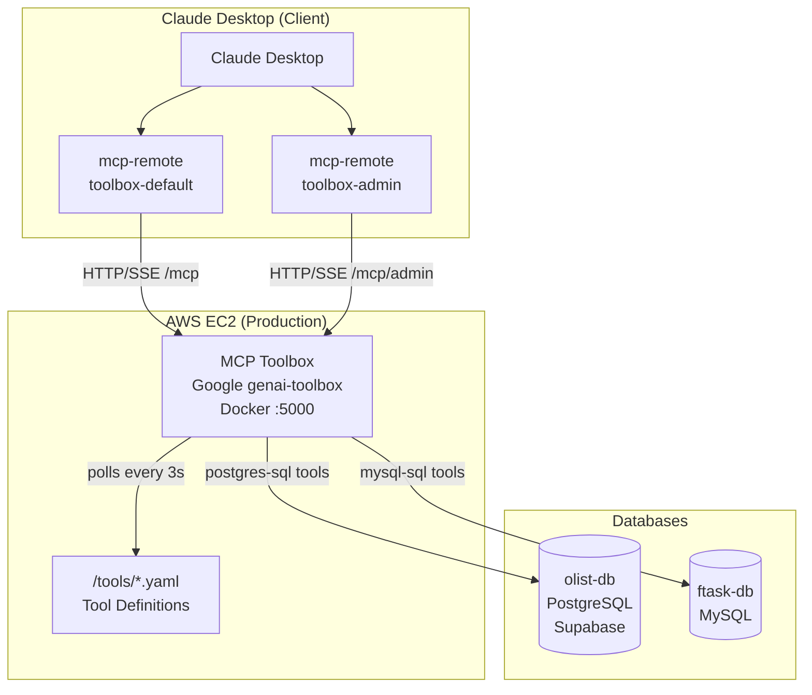
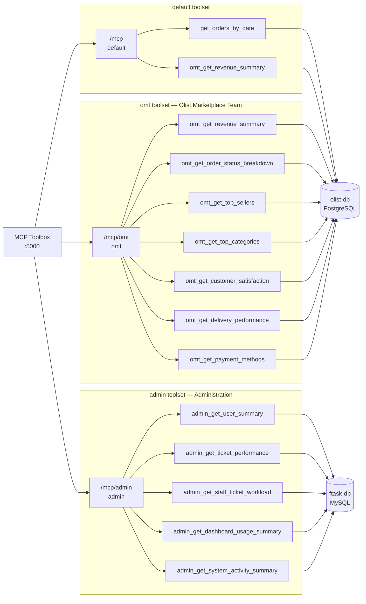
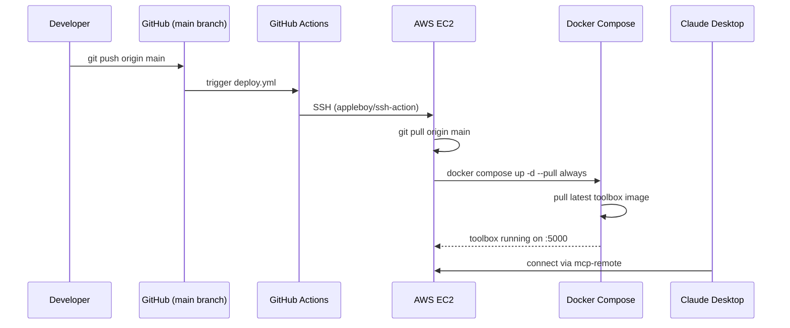
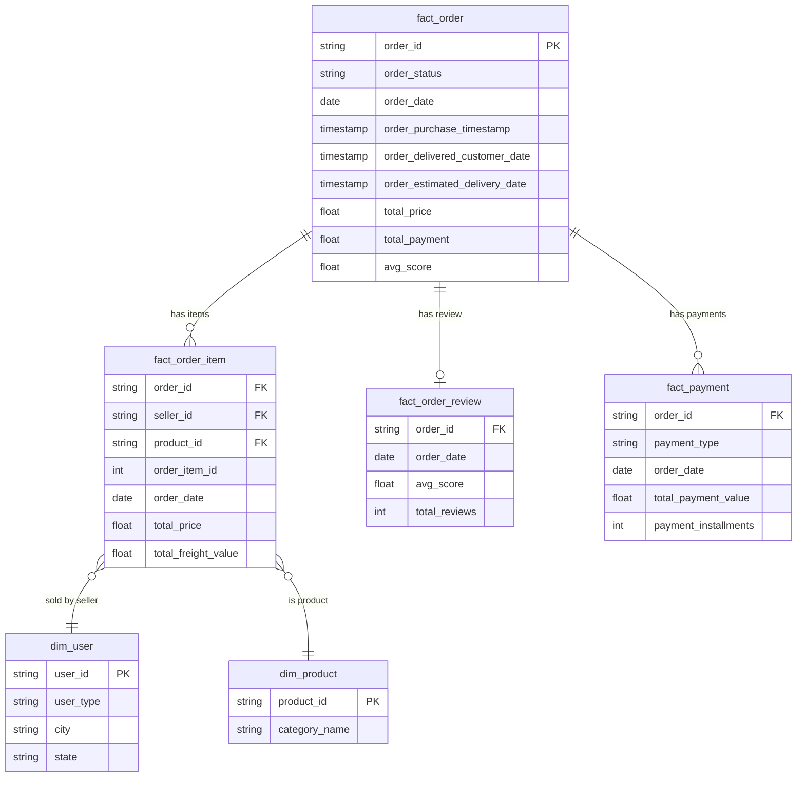
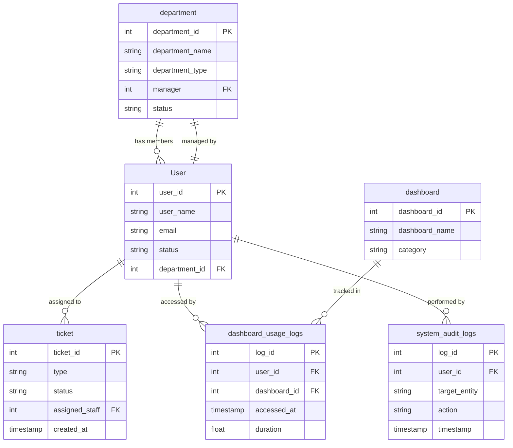

# System Architecture Overview

## High-Level Architecture



---

## Toolset → Tool → Database Mapping



---

## CI/CD Deployment Flow



---

## Data Model

### olist-db — Supabase PostgreSQL



### ftask-db — MySQL



---

## Components

### 1. Claude Desktop
The AI client. Connects to the MCP Toolbox via `mcp-remote` — an npm package that bridges MCP's SSE transport to Claude Desktop's stdio interface.

Each configured server in `claude_desktop_config.json` maps to one toolset endpoint:

| Config Key | Endpoint | Toolset |
|---|---|---|
| `toolbox-default` | `/mcp` | default |
| `toolbox-admin` | `/mcp/admin` | admin |

### 2. MCP Toolbox (Google genai-toolbox)
The core backend. Runs as a Docker container and:
- Reads YAML configs from the mounted `tools/` directory
- Exposes each tool as an MCP-compatible function
- Auto-reloads configs every 3 seconds (no restart needed)
- Provides a test UI at `/ui` and REST API at `/api/toolset/`

### 3. Databases

| Name | Engine | Host | Schema | Purpose |
|---|---|---|---|---|
| `olist-db` | PostgreSQL | Supabase | `centralize.*`, `public.*` | Olist e-commerce analytics |
| `ftask-db` | MySQL | self-hosted | `ftask.*` | Internal task management (FTask) |

---

## Tool Definition Format

Tools are defined in YAML under `tools/`. There are two kinds:

```yaml
tools:
  tool_name:
    kind: postgres-sql        # or mysql-sql
    source: olist-db          # references sources in source.yaml
    description: >
      Natural language description used by Claude to understand when/how to call this tool.
    parameters:
      - name: date_from
        type: string          # string | integer
        description: Start date (YYYY-MM-DD)
    statement: |
      SELECT ... WHERE col >= $1   -- postgres: $1, $2, ...
      -- or --
      SELECT ... WHERE col >= ?    -- mysql: positional ?
```

Parameter binding:
- **PostgreSQL** tools use `$1`, `$2`, `$3` positional placeholders
- **MySQL** tools use `?` positional placeholders

---

## Volume Mount Structure

```
tools/                          ← bind-mounted to /tools in container
├── .env                        ← DB credentials (DB_HOST, DB_PORT, DB_NAME, DB_USER, DB_PASSWORD)
├── source.yaml                 ← declares olist-db (postgres), ftask-db (mysql)
├── toolsets.yaml               ← maps toolset names → list of tool names
├── orders.yaml                 ← tool: get_orders_by_date
├── dept_omt.yaml               ← tools: omt_*  (7 tools)
└── dept_admin.yaml             ← tools: admin_* (5 tools)
```

---

## Configuration Files

| File | Purpose |
|---|---|
| `docker-compose.yml` | Defines the `toolbox` service, port mapping, volume, env |
| `tools/source.yaml` | DB connection definitions (host, port, db, credentials via env vars) |
| `tools/toolsets.yaml` | Toolset registry — maps names to tool lists |
| `tools/.env` | DB credentials loaded into the container at runtime |
| `claude_desktop_config.example.json` | Template for `%APPDATA%\Claude\claude_desktop_config.json` |
| `.github/workflows/deploy.yml` | CI/CD: auto-deploy to EC2 on push to `main` |

---

## Adding New Tools (Summary)

1. Create or edit a YAML file in `tools/` (e.g. `tools/dept_marketing.yaml`)
2. Define one or more tools with `kind`, `source`, `description`, `parameters`, `statement`
3. Register each tool name in `tools/toolsets.yaml` under an existing or new toolset
4. Toolbox picks up the change within 3 seconds — no restart needed
